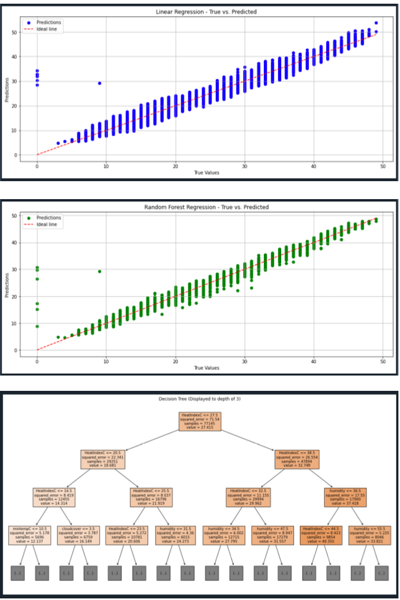

# Weather Forecasting Model

In this project, a comprehensive dataset of weather conditions spanning over a decade is utilized. This dataset encompasses diverse metrics such as maximum and minimum temperatures, cloud cover, humidity, UV index, moon illumination, sunrise and sunset timings, and wind speeds, among others. With hourly granularity, each record provides a detailed snapshot of the prevailing atmospheric conditions. Given the structure and depth of this dataset, the primary objective is to predict the temperature ("tempC") based on the other environmental attributes.

To achieve this goal, three distinct machine learning algorithms: Linear Regression, Decision Tree, and Random Forest are implemented and analyzed. Each of these algorithms has its unique strengths and methodologies to model the relationship between the provided features and the target variable (temperature). By evaluating their performances, the aim is to deduce which method offers the most accurate temperature predictions for this dataset.

## Dataset

The dataset (`weatherforecasting.csv`) is used for training and evaluating the models. It includes the following features:

- `maxtempC`
- `mintempC`
- `cloudcover`
- `humidity`
- `tempC`
- `sunHour`
- `HeatIndexC`
- `precipMM`
- `pressure`
- `windspeedKmph`

## Code Overview

1. **Data Preprocessing:**
   - Loading the dataset and handling missing values.
   - Selecting relevant numerical features.

2. **Visualizing the Data:**
   - Plotting time-series and relationships between features and the target variable.

3. **Data Splitting:**
   - Splitting the dataset into training and testing sets.

4. **Linear Regression:**
   - Training the Linear Regression model.
   - Evaluating performance metrics:
     - Mean Absolute Error (MAE)
     - Mean Squared Error (MSE)
     - Root Mean Squared Error (RMSE)
     - R-squared (R2)

5. **Decision Tree Regression:**
   - Training the Decision Tree Regression model.
   - Evaluating performance metrics.

6. **Random Forest Regression:**
   - Training the Random Forest Regression model.
   - Evaluating performance metrics.

7. **Visualizing Predictions:**
   - Plotting predictions against true values for Linear Regression and Random Forest Regression.

8. **Visualizing Decision Tree:**
   - Displaying a portion of the Decision Tree.

9. **Visualization**
   - Below are some images

  
  

## Usage

1. Clone the repository:

    ```bash
    git clone https://github.com/Razib91lightspeed/Weather-Forecasting-Model.git
    ```
    ```bash
    cd weather-forecasting
    ```

2. Install the required libraries:

    ```bash
    pip install -r requirements.txt
    ```

3. Run the Jupyter Notebook:

    ```bash
    jupyter notebook
    ```

4. Open the `WeatherForecasting.ipynb` notebook for a detailed walkthrough of the model implementation.

## Contributors

- Razib Hasan
- Huang Xiaosi

## License

This project is licensed under the MIT License.
